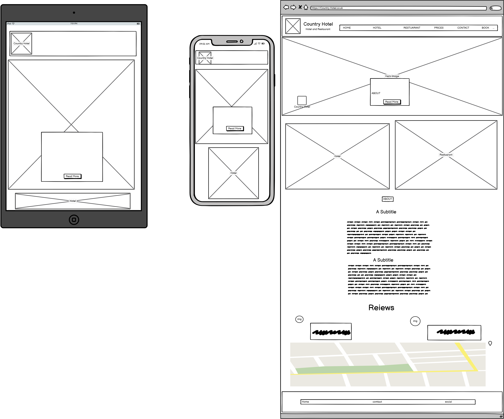
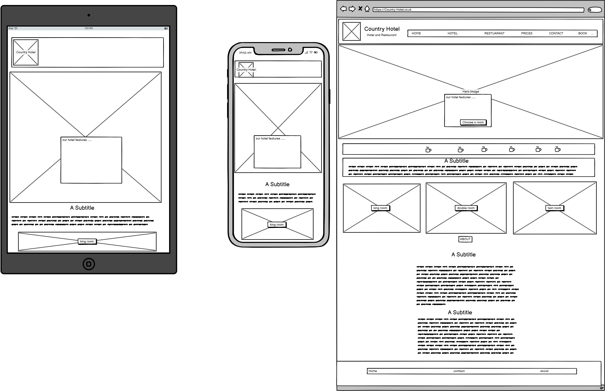
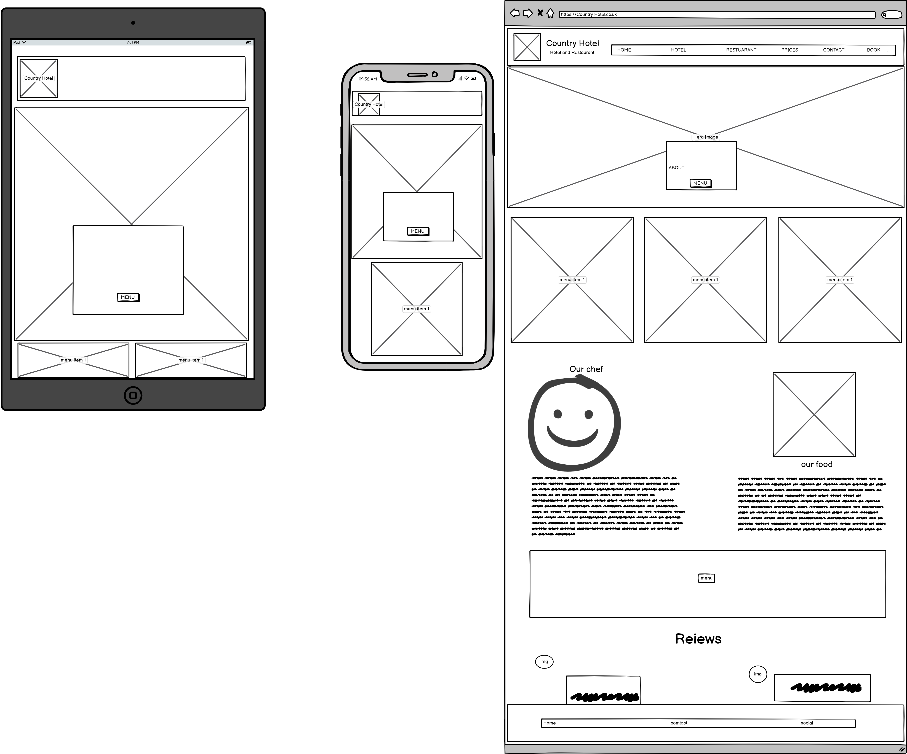
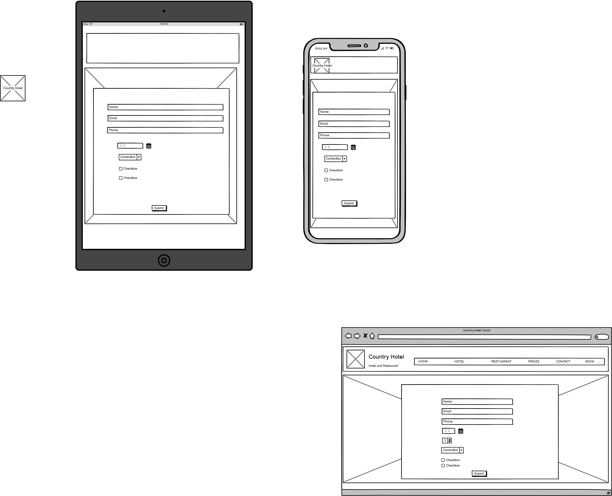
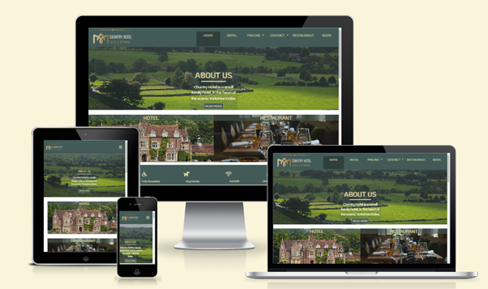
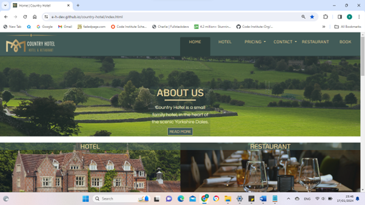
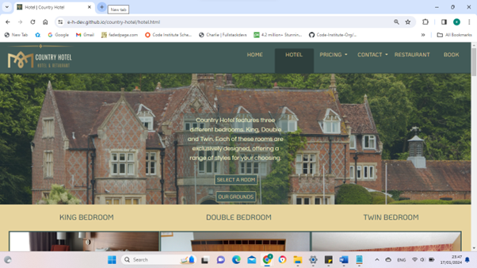
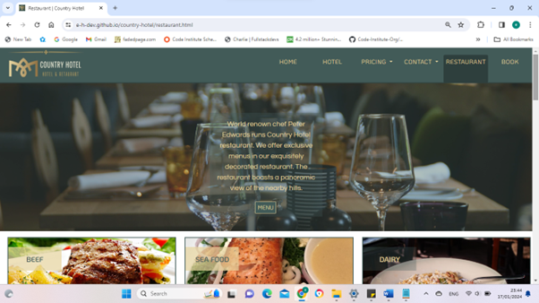
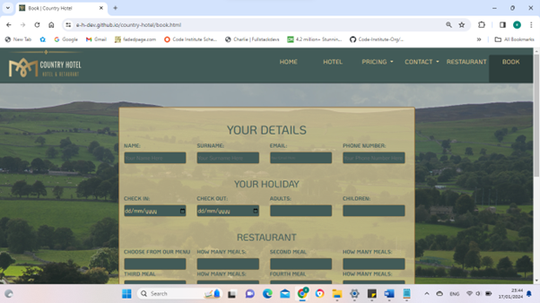
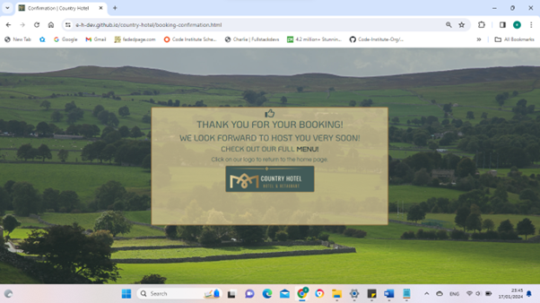

# First Milestone Project

# Country Hotel

## Table of Contents

- [First Milestone Project](#first-milestone-project)
- [Country Hotel](#country-hotel)
  - [Table of Contents](#table-of-contents)
- [About](#about)
  - [User Experience (UX)](#user-Experience-ux)
    - [User Stories](#user-stories)
      - [Hotel Owner Goals](#hotel-owner-goals)
      - [Site Visitor Goals](#site-visitor-goals)
- [Design](#design)
    - [Color Scheme](#color-scheme)
    - [Typography](#typography)
    - [Imagery](#imagery)
    - [Wireframes](#wireframes)
- [Country Hotel pages](#country hotel pages)
  - [Features](#features)
  - [Home page](#the-home-page)
  - [Hotel page](#the-hotel-page)
  - [Restaurant page](#the-restaurant-page)
  - [Book page](#the-book-page)
  - [Confirmaiton page](#the-booking-confirmation)
* [Accessibility](#accessibility)

* [Technologies Used](#technologies-used)
  * [Languages Used](#languages-used)
  * [Frameworks, Libraries & Programs Used](#frameworks-libraries--programs-used)

* [Deployment & Local Development](#deployment--local-development)
  * [Deployment](#deployment)
  * [Local Development](#local-development)
    * [How to Fork](#how-to-fork)
    * [How to Clone](#how-to-clone)

* [Testing](#testing)

- [Bugs](#bugs)
* [Credits](#credits)
  * [Code Used](#code-used)
  * [Content](#content)
  * [Media](#media)
  * [Acknowledgments](#acknowledgments)

# About

Country Hotel is a fictional, family run hotel company. The company owns a hotel in the heart of the British countryside. As a small family run business, the publicity of the company had been only via other media outlets, social media, local phone books and the like. The family have decided, to expand the business, by creating their own website to publicise and promote their hot and services. The decision was to create their own front-end website.

## User Experience (UX)

### User Stories

#### Hotel Owner Goals

- We want the website to attract a new and wide range of customers.
- We want an attractive website which clearly shows our goals as hotel owners, providing an exclusive Experience to our guests.
- We want the website to be easy and clear to use.
- We want the website to be responsive to all devices.

#### Site Visitor Goals

- I want to have access to clear details regarding the Hotel if I was to book a stay.
- I want to be able to contact the hotel in the simplest way.
- I want to see what the company have to offer, on their restuarant menu.
- I want the site to be responsive to my device.
- I want the site to be easy to navigate.

# Design

### Colour Scheme

I designed my colour scheme, based on the Country Hotel logo. For the logo design I used the website [Canva](https://www.canva.com/). Based on the colour of the logo I have designed the website.

- I have used `#425B58` for the dark text in the light background sections of the web pages.
- I have used `#E7D49E` for the light text in the dark background sections of the web pages.
- I have used `#E7D49E` for the light background small sections of the web pages.
- I have used `#425B58` for the dark background sections of the web pages.
- I have used `#FAFADD` for the light background large sections of the web pages.
- I have used `#425B58` for the opaque overlay of bright images.
- I have used `#425B58` for the dark borders.
- I have used `#E7D49E` for the light borders.
- I have used `#927242` for the darker brown text.
- I have used `#2E3F3D` for the darker footer background.
- I have used `#FFFFFF` for the main body background.

### Typography

The fonts used in this website are KoHo and Questrial, both these fonts were suggested for the logo by [Canva](https://www.canva.com/). These fonts work well together. I used KoHo in uppercase for the headers and for the rest of the text across the website I have used Questrial.
Both fonts are imported from google fonts [KoHo](https://fonts.google.com/specimen/KoHo?query=koho) and [Questrial](https://fonts.google.com/specimen/Questrial?query=quest) they are used via the import link at the head of the [stylesheet](assets/css/style.css), this links all the text across the pages of the website to the appropriate style and font.

### Imagery

As the website is for country hotel, which is located in the heart of the Yorkshire Dales. I have used a beutiful image of the Yorkshire landscape for the hero image. This image as all the images in the website, is downloaded with a full license from [piaxabay](https://pixabay.com/photos/country-countryside-dales-england-21460/). The hero image of the hotel page is from [pixabay](https://pixabay.com/photos/hotel-country-hotel-house-896569/) this is a typical British Manor house converted into a hotel. The hero image for the restaurant page is also downloaded from [pixabay](https://pixabay.com/photos/table-bar-restaurant-drink-food-3084384/).

### Wireframes

Wireframes were created for mobile, tablet and desktop using balsamiq.

#### Home Page

#### Hotel Page

#### Restaurant Page

#### Book Page

## Country Hotel Pages

### Features

The website is comprised of a home page, a hotel page, a restaurant page, a booking page & a booking confirmation page.

All Pages on the website are responsive and have:

* A favicon in the browser tab.

  

* The title of the site at the top of every page. This title also acts as a link back to the home page.
  

#### The Home Page

The home page of Country Hotel displays the sites name/logo as a title and then a nav bar shows the links to the other pages. on mobile the links are located in the dropdown. Below is the hero image with a small box of info text, there is a read more button, this taked the user down to the main information section. Below the hero image are two images with titles, these are links one for the hotel page the other for the restaurant page. they are more interactive and will catch the attention of the user. Below is the main information section, below that is the location section, this consists of the address, and an iframe with a goole map. After that is the reveiw section, where previous guests have lesft a star rating and a reveiw. This brings the page to the footer, the footer has three columns (on mobile they are laid out vertically) the first is logo link which brings the user to th top pf the page. The second is contact information and the third column has the social media links. 

#### The Hotel Page

The hotel page can be navigated to via the nav hotel link at the header of each page. Alternatively the Hotel page can be reached form the hotel image link on the Home page. The Hjotel page contains a hero image of the hotel exterior, this has an iformation box with explaini gthe available bedrooms, country hotel has to offer. The information box has two link buttons one taking th euser to the bedroom choice section, the second taking ht euser to the grounds information section. Below the hero image is three links to information abot the bedrooms, below are the three information sections 1. king bedrooms 2. double bedrooms 3. twin bedrooms. The grounds section has information about the grounds with a gallery of six iamges around country hotel. The footer is the same footer as the home page footer.

#### The Restaurant page

The resttaurant page is navigated to in same two ways as the Hotel page. The rstaurant page consisits of a hero image of the interior of the hotel restaurant. The hero image has a samll informaiton section about the restaurant and the chef. There is a menu link button taming the user to the menu. Below the hero image is the information section, this is split into two columns, the left is the information about the chef, and the right column describes the restaurant. Below is the menu split into three sections 1. Beef 2. Sea food 3. Dairy.

#### The Book page

The book page is navigated to by the book link in the navbar. The use, if wishing to contact and book a stay at Country Hotel can fill in a form with name, surname, email address, phone number, dates of check in and chck out. The user and order one or more meals for his stay, from the restaurant menu. The user will then click the book now bitton and a booking confirmation message will come on the screen. 

#### The booking confirmation

The booking confirmation does not have a nav bar or footer, it has a message confirming the booking. The user has an option to heck out the menu from the menu link on th econfirmation page, this ill open a new tab to the restaurant page. The user will be guided back to the home with a message to click on the logo.

- - -

### Accessibility

I have been mindful during coding to ensure that the website is as accessible friendly as possible. This has been have achieved by:

* Using semantic HTML.
* Using a hover state on all buttons on the site to make it clear to the user if they are hovering over a button.
* Choosing a sans serif font for the site - these fonts are suitable for people with dyslexia.
* Ensuring that there is a sufficient colour contrast throughout the site.

  

- - -

## Technologies Used

### Languages Used

HTML, CSS

### Frameworks, Libraries & Programs Used

* [Balsamiq](https://balsamiq.com/) - Used to create wireframes.

* [Git](https://git-scm.com/) - For version control.

* [Github](https://github.com/) - To save and store the files for the website.

* [Codeanywhere](https://app.codeanywhere.com/)

* [GitPod](https://gitpod.io/) - IDE used to create the site.

* [Google Fonts](https://fonts.google.com/) - To import the fonts used on the website.

* [Google Developer Tools](https://developers.google.com/web/tools) - To troubleshoot and test features, solve issues with responsiveness and styling.

* [Favicon.io](https://favicon.io/) To create favicon.

* [Am I Responsive?](http://ami.responsivedesign.is/) To show the website image on a range of devices.

* [Web Disability Simulator](https://chrome.google.com/webstore/detail/web-disability-simulator/olioanlbgbpmdlgjnnampnnlohigkjla) - a google chrome extension that allows you to view your site as people with accessibility needs would see it.

* [Webpage Spell-Check](https://chrome.google.com/webstore/detail/webpage-spell-check/mgdhaoimpabdhmacaclbbjddhngchjik/related) - a google chrome extension that allows you to spell check your webpage. Used to check the site and the readme for spelling errors.

- - -

## Deployment & Local Development

### Deployment

The site is deployed using GitHub Pages - [Country Hotel](https://e-h-dev.github.io/country-hotel/index.html).

To Deploy the site using GitHub Pages:

1. Login (or signup) to Github.
2. Go to the repository for this project, [e-h-dev/CountryHotel](hhttps://github.com/e-h-dev/country-hotel)
3. Click the settings button.
4. Select pages in the left hand navigation menu.
5. From the source dropdown select main branch and press save.
6. The site has now been deployed, please note that this process may take a few minutes before the site goes live.

### Local Development

#### How to Fork

To fork the repository:

1. Log in (or sign up) to Github.
2. Go to the repository for this project, [e-h-dev/CountryHotel](hhttps://github.com/e-h-dev/country-hotel)
3. Click the Fork button in the top right corner.

#### How to Clone

To clone the repository:

1. Log in (or sign up) to GitHub.
2. Go to the repository for this project, [e-h-dev/CountryHotel](hhttps://github.com/e-h-dev/country-hotel)
3. Click on the code button, select whether you would like to clone with HTTPS, SSH or GitHub CLI and copy the link shown.
4. Open the terminal in your code editor and change the current working directory to the location you want to use for the cloned directory.
5. Type 'git clone' into the terminal and then paste the link you copied in step 3. Press enter.

- - -

## Testing

Please refer to [TESTING.md](TESTING.md) file for all testing carried out.

## Bugs

| No | Bug | How I fixed the bug |
| :--- | :--- | :--- |
| 1 | The active class on the nav section was a border-bottom solid line, the line was not symmetrical  below each of nav elements. | I changed the active class, by giving each list item, a backgrond colour darker than the nav bar. |
| 2 | The drop-down elements in the navbar, did not dispaly properly on mobile and tablet. The information was blocked by the next list item. | After trying out a various ideas, I realised the drop-down information was only blocked by the second drop-down link, and not by the next nav-item. I then changed the order of the nav links, now one drop-down did not drop over the other. |
| 3 | After I changed the order of the nav links the symmetry of the whole nav bar looked odd on desktop. | I decided to create two nav links for navigation to resturant.html one after both dropdown links for desktop, using the .d bootstrap class I made this one visible only for desktop. The second link to restaurant.html I placed between the dropdown links and using the .d bootstrap class made it visible only for mobile and tablet. |
| 4 | On restaurant.html I used bootstraps row and col classes to create the information article, the chef info in one column and the genaral info in a second column. After I finished the styling of the chef info and strated with the general info, it came out below the chef info even on desktop. | I spent long time checknig my code to see if I had made mistakes, I compare them to the bootstrap documentation and I could not find the reason for the bug. I tested the link to bootstrap it was working. I then used Devtools and checked multiple times, I relised eventually that the class chef-about which styles the chef info paragraph, I had inserted into the main div of the column (together with the bootstrap class). The chef-about class creates a box whoch is smaller than the overall column width, this therefore caused the next column to start at the edge of the column which was below the chef info. I fixed the bug by creating a separate div for the chef-about class, the main column therefore, used the full width of the page. this gave the space for the next column to start beside the first, rather than under it. |
| 5 | Horizontal scrolling. | Using devtools I deleted elemnets of the affected pages one by one, untill the horizontal scroll had dissapeared. Then by process of elimination I determined which element was causing the horizontal overflow. Once I figured out the cause I computed the size if each child element of the affected element untill I worked out which was too wide, I then adjusted the width to fit the page.|
| 6 | Fixed navbar blocks hero image. | I created a div above the the hero image and gave it a height of 120px, this pushed down th hero image. The navbar only covers the div and not the hero image. |
| 7 | The fixed navbar made the elements in the page look messy, they were the same colour as the navbar but have different widths. When scrolling down the moing elements toucjing the navbar crated an uneven edge to the navbar. | I gave the navbar a bottom border of 3px with  darker colour, this gave the navbar an appearance of being above the ret of the page on the z-index. |
| 8 | When testing the page on  a wider device the info box in the hero image was not centered. | I researched the topic of parent and child ivs and I found the best and most relavant way to center a child in a parent, by using the flexbox in css. this I found in a blog by [openreplay](https://blog.openreplay.com/five-css-ways-of-centering-a-child-in-its-parent/). |

When testing the page on  a wider device the info box in the hero image was not centered. | I researched the topic of parent and child ivs and I found the best and most relavant way to center a child in a parent, by using the flexbox in css. this I found in a blog by [openreplay](https://blog.openreplay.com/five-css-ways-of-cen
