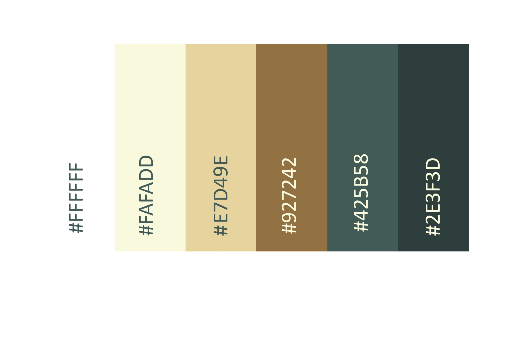

# First Milestone Project

# Country Hotel

## Table of Contents

- [First Milestone Project](#first-milestone-project)
- [Country Hotel](#country-hotel)
  - [Table of Contents](#table-of-contents)
- [About](#about)
  - [User Experience (UX)](#user-Experience-ux)
    - [User Stories](#user-stories)
      - [Hotel Owner Goals](#hotel-owner-goals)
      - [Site Visitor Goals](#site-visitor-goals)
- [Design](#design)
    - [Color Scheme](#color-scheme)
    - [typography](#typography)
- [Bugs](#bugs)

# About

Country Hotel is a fictional, family run hotel company. The company owns a hotel in the heart of the British countryside. As a small family run business, the publicity of the company had been only via other media outlets, social media, local phone books and the like. The family have decided, to expand the business, by creating their own website to publicise and promote their hot and services. The decision was to create their own front-end website.

## User Experience (UX)

### User Stories

#### Hotel Owner Goals

- We want the website to attract a new and wide range of customers.
- We want an attractive website which clearly shows our goals as hotel owners, providing an exclusive Experience to our guests.
- We want the website to be easy and clear to use.
- We want the website to be responsive to all devices.

#### Site Visitor Goals

- I want to have access to clear details regarding the Hotel if I was to book a stay.
- I want to be able to contact the hotel in the simplest way.
- I want to see what the company have to offer, on their restuarant menu.
- I want the site to be responsive to my device.
- I want the site to be easy to navigate.

# Design

### Colour Scheme

I designed my colour scheme, based on the Country Hotel logo. For the logo design I used the website [Canva](https://www.canva.com/){:target="_blank}. Based on the colour of the logo I have designed the website.

- I have used `#425B58` for the dark text in the light background sections of the web pages.
- I have used `#E7D49E` for the light text in the dark background sections of the web pages.
- I have used `#E7D49E` for the light background small sections of the web pages.
- I have used `#425B58` for the dark background sections of the web pages.
- I have used `#FAFADD` for the light background large sections of the web pages.
- I have used `#425B58` for the opaque overlay of bright images.
- I have used `#425B58` for the dark borders.
- I have used `#E7D49E` for the light borders.
- I have used `#927242` for the darker brown text.
- I have used `#2E3F3D` for the darker footer background.
- I have used `#FFFFFF` for the main body background.

### Typography

The fonts used in this website are KoHo and Questrial, both these fonts were suggested for the logo by [Canva](https://www.canva.com/){:target="_blank}. These fonts work well together. I used KoHo in uppercase for th headers and for the rest of the text across the website I have used Questrial.
Both fonts are imported from google fonts and are used via the import link at the head of the [stylesheet](assets/css/style.css), this links all the text across the pages of the website to the appropriate style and font.

## Bugs

| No | Bug | How I fixed the bug |
| :--- | :--- | :--- |
| 1 | The active class on the nav section was a border-bottom solid line, the line was not symmetrical  below each of nav elements. | I changed the active class, by giving each list item, a backgrond colour darker than the nav bar. |
| 2 | The drop-down elements in the navbar, did not dispaly properly on mobile and tablet. The information was blocked by the next list item. | After trying out a various ideas, I realised the drop-down information was only blocked by the second drop-down link, and not by the next nav-item. I then changed the order of the nav links, now one drop-down did not drop over the other. |
| 3 | After I changed the order of the nav links the symmetry of the whole nav bar looked odd on desktop. | I decided to create two nav links for navigation to resturant.html one after both dropdown links for desktop, using the .d bootstrap class I made this one visible only for desktop. The second link to restaurant.html I placed between the dropdown links and using the .d bootstrap class made it visible only for mobile and tablet. |
| 4 | On restaurant.html I used bootstraps row and col classes to create the information article, the chef info in one column and the genaral info in a second column. After I finished the styling of the chef info and strated with the general info, it came out below the chef info even on desktop. | I spent long time checknig my code to see if I had made mistakes, I compare them to the bootstrap documentation and I could not find the reason for the bug. I tested the link to bootstrap it was working. I then used Devtools and checked multiple times, I relised eventually that the class chef-about which styles the chef info paragraph, I had inserted into the main div of the column (together with the bootstrap class). The chef-about class creates a box whoch is smaller than the overall column width, this therefore caused the next column to start at the edge of the column which was below the chef info. I fixed the bug by creating a separate div for the chef-about class, the main column therefore, used the full width of the page. this gave the space for the next column to start beside the first, rather than under it. |
