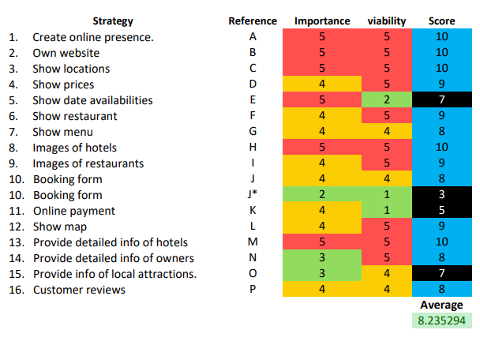
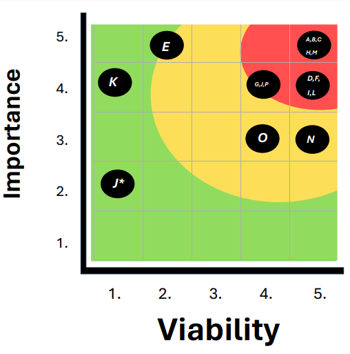

# First Milestone Project

# Country Hotel

## Table of Contents

- [First Milestone Project](#first-milestone-project)
- [Country Hotel](#country-hotel)
- [Table of Contents](#table-of-contents)
- [About](#about)
- [User Experience (UX)](#user-Experience-ux)
  - [User Stories](#user-stories)
    - [Hotel Owner Goals](#hotel-owner-goals)
    - [Site Visitor Goals](#site-visitor-goals)
  - [Strategy Tradeoffs](#strategy-tradeoffs)
    - [Strategy Criteria](#strategy-criteria)
    - [Strategy Table](#strategy-table)
    - [Strategy Assesment](#strategy-assesment)
    - [Strategy Graph](#strategy-graph)
    - [Strategy Reasons](#strategy-reasons)
- [Design](#design)
    - [Colour Scheme](#colour-scheme)
    - [Typography](#typography)
    - [Imagery](#imagery)
    - [Wireframes](#wireframes)
- [Country Hotel pages](#CountryHotelPages)
  - [Features](#features)
  - [Home page](#the-home-page)
  - [Hotel page](#the-hotel-page)
  - [Restaurant page](#the-restaurant-page)
  - [Book page](#the-book-page)
  - [Confirmation page](#the-booking-confirmation)
* [Accessibility](#accessibility)

* [Technologies Used](#technologies-used)
  * [Languages Used](#languages-used)
  * [Frameworks, Libraries & Programs Used](#frameworks-libraries--programs-used)

* [Deployment & Local Development](#deployment--local-development)
  * [Deployment](#deployment)
  * [Local Development](#local-development)
    * [How to Fork](#how-to-fork)
    * [How to Clone](#how-to-clone)

* [Testing](#testing)

- [Bugs](#bugs)
  * [Solved bugs](#solved-bugs)
  * [Known bugs](#known-bugs)
* [Credits](#credits)
  * [Code Used](#code-used)
  * [Content](#content)
  * [Media](#media)
  * [Acknowledgments](#acknowledgments)

# About

Country Hotel is a fictional, family run hotel company. The company owns a hotel in the heart of the British countryside. As a small family run business, the publicity of the company had been only via other media outlets, social media, local phone books and the like. The family have decided, to expand the business, by creating their own website to publicise and promote their hotel and services. The decision was to create their own front-end website.

## User Experience (UX)

### User Stories

#### Hotel Owner Goals

- We want the website to attract a new and wide range of customers.
- We want an attractive website which clearly shows our goals as hotel owners, providing an exclusive Experience to our guests.
- We want the website to be easy and clear to use.
- We want the website to be responsive to all devices.

#### Site Visitor Goals

- I want to have access to clear details regarding the Hotel if I was to book a stay.
- I want to be able to contact the hotel in the simplest way.
- I want to see what the company have to offer, on their restaurant menu.
- I want the site to be responsive to my device.
- I want the site to be easy to navigate.

### Strategy Tradeoffs 

#### Strategy criteria

- When creating the website and deciding what must be featured for the use of the site visitors, I decided on sixteen main criteria this are listed in the [table](#strategy-table) below. I then had to strategise and work out which of the sixteen were most important and which could be traded off.

- The strategy I used was to give each of the sixteen criteria a score on two separate accounts, the first how important that specific item was for the user's need, the second how viable is it to include the item in a front end website.

- The following table Illustrates the scores given on both acoounts of judgement.

#### Strategy Table

#### Strategy Assesment

- After tallying the two scores for each criteria item, I then calculated the average of all sixteen criteria. This is evident in the above image the resulting average was 8.235, the next step was to plot all sixteen criteria in a graph, the graph is colour coded from red the most relavant across both scores, to green the least relavant. All criteria which scored eight or more, were close enough to the red zone, to be considred relavent to be included in the make up of the website.

#### Strategy Graph

#### Strategy Reasons

- In the table below I have documented the reasons why each part of the sixteen criteria was either added to the website or was not, the reasoning shows how I judged each criteria to see if it is important and viable.

| Number | Possible Goal | Reference | Importance-score | Viability-score | Reason |
| :--- | :--- | :--- | :--- | :--- | :--- |
| 1 | Create online presence | A | 5 | 5 | Most hotel customers gather info online. |
| 2 | Own website | B | 5 | 5 | Better online presence easier to show info. |
| 3 | Show locations | C | 5 | 5 | Expected. |
| 4 | Show prices | D | 4 | 5 | Customers like to see pricing. |
| 5 | Show date availabilities | E	 | 5 | 2 | Difficult in simple website, but very important. |
| 6 | Show restaurant | F | 4 | 5 | Very necessary, as big part of product. |
| 7 | Show menu | G | 4 | 4 | Many customers like to see availability. |
| 8 | Images of hotels | H | 5 | 5 | Basic expectation |
| 9 | Images of restaurants | I | 4 | 5 | Expected |
| 10 | Booking form | J,J* | 4 | 4 | Quite easy to make, *  can’t connect to server with front-end. |
| 11 | Online payment | K | 4 | 1 | Not viable in front-end. |
| 12 | Show map | L | 4 | 4 | Can put in postcode, better to include google map  iframe, more provides better user experience. |
| 13 | Provide detailed info of hotels | M | 5 | 5 | Expected. |
| 14 | Provide detailed info of owners | N | 3 | 5 | Many customers feel more comfortable with service with such info provided. |
| 15 | Provide info of local attractions. | O | 3 | 4 | Very useful, may be bad for competition if providing hospitality info. |
| 16 | Customer reviews | P | 4 | 4 | Most customers want to see the experience of others. | 

---

# Design

### Colour Scheme

I designed my colour scheme, based on the Country Hotel logo. For the logo design I used the website [Canva](https://www.canva.com/). Based on the colour of the logo I have designed the website.

- I have used `#425B58` for the dark text in the light background sections of the web pages.
- I have used `#E7D49E` for the light text in the dark background sections of the web pages.
- I have used `#E7D49E` for the light background small sections of the web pages.
- I have used `#425B58` for the dark background sections of the web pages.
- I have used `#FAFADD` for the light background large sections of the web pages.
- I have used `#425B58` for the opaque overlay of bright images.
- I have used `#425B58` for the dark borders.
- I have used `#E7D49E` for the light borders.
- I have used `#927242` for the darker brown text.
- I have used `#2E3F3D` for the darker footer background.
- I have used `#FFFFFF` for the main body background.

### Typography

The fonts used in this website are KoHo and Questrial, both these fonts were suggested for the logo by [Canva](https://www.canva.com/). These fonts work well together. I used KoHo in uppercase for the headers and for the rest of the text across the website I have used Questrial.
Both fonts are imported from google fonts [KoHo](https://fonts.google.com/specimen/KoHo?query=koho) and [Questrial](https://fonts.google.com/specimen/Questrial?query=quest) they are used via the import link at the head of the [stylesheet](assets/css/style.css), this links all the text across the pages of the website to the appropriate style and font.

### Imagery

As the website is for country hotel, which is in the heart of the Yorkshire Dales. I have used a beautiful image of the Yorkshire landscape for the hero image. This image as all the images on the website, is downloaded with a full license from [piaxabay](https://pixabay.com/photos/country-countryside-dales-england-21460/). The hero image of the hotel page is from [pixabay](https://pixabay.com/photos/hotel-country-hotel-house-896569/) this is a typical British Manor house converted into a hotel. The hero image for the restaurant page is also downloaded from [pixabay](https://pixabay.com/photos/table-bar-restaurant-drink-food-3084384/).

### Wireframes

Wireframes were created for mobile, tablet and desktop using balsamiq.

#### Home Page

#### Hotel Page

#### Restaurant Page

#### Book Page

## Country Hotel Pages

### Features

The website is comprised of a home page, a hotel page, a restaurant page, a booking page & a booking confirmation page.

All Pages on the website are responsive and have:

* A favicon in the browser tab.

  

* The title of the site at the top of every page. This title also acts as a link back to the home page.
  

#### The Home Page

The home page of Country Hotel displays the sites name/logo as a title and then a nav bar shows the links to the other pages, on mobile the links are in the dropdown. Below the navbar is the hero image with a small box of information text, there is a read more button, this takes the user down to the main information section. Below the hero image are two images with titles; these are links, one for the hotel page, the other for the restaurant page. They images are large and animated to catch the attention of the user. Below the links is the main information section, below that is the location section, this consists of the address, and an iframe with a Google map. After that is the review section, where previous guests have left a star rating and a review. This brings the page to the footer; the footer has three columns (on mobile they are laid out vertically) the first is logo link which brings the user to the top of the page. The second is contact information and the third column has the social media links. 

#### The Hotel Page

The hotel page can be navigated to via the nav hotel link at the header of each page. Alternatively, the Hotel page can be reached from the hotel image link on the Home page. The Hotel page contains a hero image of the hotel exterior, this has an information box describing the available bedrooms, country hotel has to offer. The information box has two link buttons one taking the user to the bedroom choice section, the second taking the user to the ground's information section. Below the hero image is three links to information about the bedrooms, below that are the three information sections 1. king bedrooms 2. double bedrooms 3. twin bedrooms. The grounds section has information about the grounds with a gallery of six images from around the hotel grounds. The footer is the same footer as the home page footer.

#### The Restaurant page

The restaurant page is navigated to in same two ways, as the Hotel page. The restaurant page consists of a hero image showing the interior of the hotel restaurant. The hero image has a small information box about the restaurant and the chef. There is a menu link button taking the user to the menu. Below the hero image is three image links the user can navigate with to each of the three sections of the menu. Below these links is the information section, this is split into two columns, the left is the information about the chef, and the right column describes the restaurant. Below that is the menu, the menu is split into three sections 1. Beef 2. Sea food 3. Dairy.

#### The Book page

The book page is navigated to by the book link in the navbar. The user, if wishing to contact and book a stay at Country Hotel, can fill in a form with name, surname, email address, phone number, dates of check in and check out, and number of adult and children guests coming to stay. The user can order one or more meals for his stay, from the restaurant menu section of the form. The user will then click the book now button and a booking confirmation message will come on the screen. 

#### The booking confirmation

The booking confirmation does not have a nav bar or footer, it has a message confirming the booking. The user has an option to check out the menu from the menu link (the bold word menu) on the confirmation page, this will open a new tab to the restaurant page. The user will be guided back to the home with a message to click on the logo.

- - -

### Accessibility

I have been mindful during coding to ensure that the website is as accessible friendly as possible. This has been have achieved by:

* Using semantic HTML.
* Using a hover state on all buttons on the site to make it clear to the user if they are hovering over a button.
* Choosing a sans serif font for the site - these fonts are suitable for people with dyslexia.
* Ensuring that there is a sufficient colour contrast throughout the site.

- - -

## Technologies Used

### Languages Used

HTML, CSS

### Frameworks, Libraries & Programs Used

* [Balsamiq](https://balsamiq.com/) - Used to create wireframes.

* [Git](https://git-scm.com/) - For version control.

* [Github](https://github.com/) - To save and store the files for the website.

* [Codeanywhere](https://app.codeanywhere.com/) - IDE used to create the site.

* [GitPod](https://gitpod.io/) - IDE used to create the site.

* [Google Fonts](https://fonts.google.com/) - To import the fonts used on the website.

* [Bootstrap 4](https://getbootstrap.com/docs/4.6/layout/overview/) - Used for layout and responsive design.

* [Google Developer Tools](https://developers.google.com/web/tools) - To troubleshoot and test features, solve issues with responsiveness and styling.

* [Favicon.io](https://favicon.io/) To create favicon.

* [Am I Responsive?](http://ami.responsivedesign.is/) To show the website image on a range of devices.

* [Web Disability Simulator](https://chrome.google.com/webstore/detail/web-disability-simulator/olioanlbgbpmdlgjnnampnnlohigkjla) - a google chrome extension that allows you to view your site as people with accessibility needs would see it.

* [Adobe Express](https://new.express.adobe.com/tools/convert-to-gif) To convert test imagery into gif files.

- - -

## Deployment & Local Development

### Deployment

The site is deployed using GitHub Pages - [Country Hotel](https://e-h-dev.github.io/country-hotel/index.html).

To Deploy the site using GitHub Pages:

1. Login (or signup) to Github.
2. Go to the repository for this project, [e-h-dev/CountryHotel](https://github.com/e-h-dev/country-hotel)
3. Click the settings button.
4. Select pages in the left-hand navigation menu.
5. From the source dropdown select main branch and press save.
6. The site has now been deployed, please note that this process may take a few minutes before the site goes live.

### Local Development

#### How to Fork

To fork the repository:

1. Log in (or sign up) to Github.
2. Go to the repository for this project, [e-h-dev/CountryHotel](https://github.com/e-h-dev/country-hotel)
3. Click the Fork button in the top right corner.

#### How to Clone

To clone the repository:

1. Log in (or sign up) to GitHub.
2. Go to the repository for this project, [e-h-dev/CountryHotel](https://github.com/e-h-dev/country-hotel)
3. Click on the code button, select whether you would like to clone with HTTPS, SSH or GitHub CLI and copy the link shown.
4. Open the terminal in your code editor and change the current working directory to the location you want to use for the cloned directory.
5. Type 'git clone' into the terminal and then paste the link you copied in step 3. Press enter.

- - -

## Testing

Please refer to [TESTING.md](TESTING.md) file for all testing carried out.

## Bugs

### Solved Bugs

| No | Bug | How I fixed the bug |
| :--- | :--- | :--- |
| 1 | The active class on the nav section was a border-bottom solid line, the line was not symmetrical below each of nav elements. | I changed the active class, by giving each list item, a background colour darker than the nav bar. |
| 2 | The drop-down elements in the navbar, did not display properly on mobile and tablet. The information was blocked by the next list item. | After trying out various ideas, I realised the drop-down information was only blocked by the second drop-down link, and not by the next nav-item. I then changed the order of the nav links, now one drop-down did not drop over the other. |
| 3 | After I changed the order of the nav links the symmetry of the whole nav bar looked odd on desktop. | I decided to create two nav links for navigation to resturant.html one after both dropdown links for desktop, using the .d bootstrap class I made this one visible only for desktop. The second link to restaurant.html I placed between the dropdown links and using the .d bootstrap class made it visible only for mobile and tablet. |
| 4 | On restaurant.html I used bootstraps row and col classes to create the information article, the chef info in one column and the general info in a second column. After I finished the styling of the chef info and started with the general restaurant information, it came out below the chef information even on desktop. | I spent long time checking the code to see if I had made mistakes, I compared the code to the bootstrap documentation and I could not find the reason for the bug. I tested the link to bootstrap it was working. I then used Devtools and checked multiple times, I realised eventually that the class chef-about which styles the chef info paragraph, was inserted into the main div of the column (together with the bootstrap class). The chef-about class creates a box which is smaller than the overall column width, this therefore caused the next column to start at the edge of the column which was below the chef info. I fixed the bug by creating a separate div for the chef-about class, the main column therefore, used the full width of the page. this gave the space for the next column to start beside the first, rather than under it. |
| 5 | Horizontal scrolling. | Using devtools I deleted elements of the affected pages one by one, until the horizontal scroll had disappeared. Then by process of elimination I determined which element was causing the horizontal overflow. Once I figured out the cause, I computed the size if each child element of the affected element until I worked out which was too wide, I then adjusted the width to fit the page.|
| 6 | Fixed navbar blocks hero image. | I created a div above the hero image and gave it a height of 120px, this pushed down the hero image. The navbar only covers the div and not the hero image. |
| 7 | The fixed navbar made some of the elements in the page look messy, they are the same colour as the navbar but have different widths. When scrolling down the moving elements touching the navbar created an uneven edge to the navbar. | I gave the navbar a bottom border of 3px with darker colour, this gave the navbar an appearance of being above the rest of the page on the z-index. |
| 8 | The fixed navbar caused the id internal links not to display in the correct place, the identified section of the page is stuck under the navbar. | I replaced the "id" to an element above the section of the link, (for some I added a new div with the "id") now the link connects to the above element and the correct part of the page is displayed below the fixed navbar. | 
| 9 | When testing the page on a wider device the info box in the hero image was not centred. | I researched the topic of parent and child divs and I found the best and most relevant way to centre a child in a parent, is by using the flexbox in css. this I found in a blog by [openreplay](https://blog.openreplay.com/five-css-ways-of-centering-a-child-in-its-parent/). |

### Known Bugs

Originally the form was designed to POST to the code institute form dump. My mentor advised me that it would be better to create a separate page, that shows after the user has submitted the form, this is better for UX. With this I created the booking confirmation page, the form is linked to open the booking-confirmation page when the form is submitted. This however, will not display or confirm the input items.

---

## Credits

### Code Used

* I used this [code](https://www.shecodes.io/athena/43168-how-to-align-navbar-to-the-right-in-bootstrap) to help with pushing the nav items, of the bootstrap navbar to the right of the navbar. By using the bootstrap class ml-auto I achieved what I was trying to create.

* For the Google maps iframe I used the code from [google maps generator](https://maps-google.github.io/embed-google-map/), this was the most efficient way of incorporating  the map on the hotel home page.

* To create the star rating on the reviews section, I wanted to have at least one review with less than five stars, to give more legitimacy to the website. To do this I used the following [code](https://www.w3schools.com/howto/howto_css_star_rating.asp) from [W3schools.com](https://www.w3schools.com/).

### Content

The information of the site is all fictional and created to simulate a real life small family run hotel in the country side, who have a small, front end based website.

### Media

All the pictures through the pages of the website are downloaded with a license, from [Pixabay](https://pixabay.com/). Follow this [link](https://pixabay.com/service/terms/) to see the terms and conditions of downloads from pixabay.

### Acknowledgments

I would like to acknowledge the following people:

* Jabril Akolade - My Code Institute Mentor.

* Kera Cudmore - For the use of her amazing github repository [The quiz arms](https://github.com/kera-cudmore/TheQuizArms). Kera's repository was recommended to me by my mentor Jabril, to help with writing my documentation.

* Callum Jones - Of Newcastle College for helping in facilitating the course.

* Kevin Hillary - Of Newcastle College for the ongoing support he is providing.

* Code institute - For all the help and well-structured lessons making this project possible after only three months of learning HTML.
