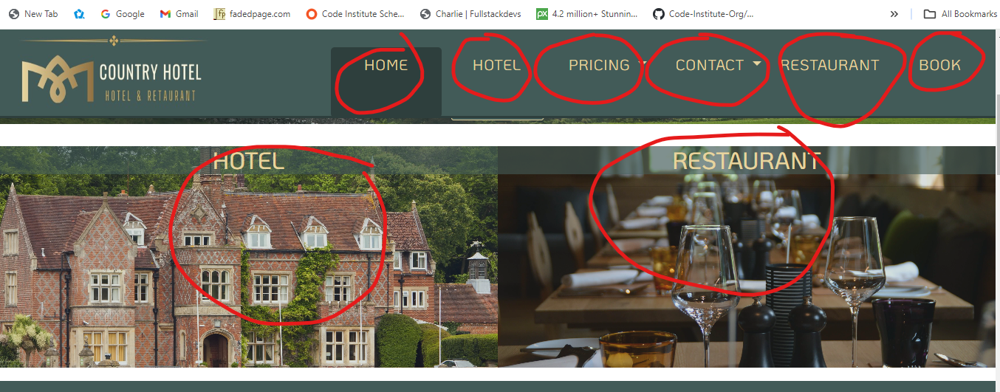

# Country Hotel -  Testing

Visit the deployed site: [Country Hotel](https://e-h-dev.github.io/country-hotel/)

- - -

## CONTENTS

* [AUTOMATED TESTING](#automated-testing)
  * [W3C Validator](#w3c-validator)
  * [Lighthouse](#lighthouse)
* [MANUAL TESTING](#manual-testing)
  * [Testing User Stories](#testing-user-stories)
  * [Full Testing](#full-testing)

Testing was ongoing throughout the entire build. I utilised Chrome developer tools whilst building to pinpoint and troubleshoot any issues as I went along.

During development I made use of google developer tools to ensure everything was working correctly and to assist with troubleshooting when things were not working as expected.

I have gone through each page using google chrome developer tools to ensure that each page is responsive on a variety of different screen sizes and devices.

- - -

## AUTOMATED TESTING

### W3C Validator

[W3C](https://validator.w3.org/) was used to validate the HTML on all pages of the website. It was also used to validate the CSS.

#### Home Page

PASSED

#### Hotel Page

PASSED

#### Restaurant Page

PASSED

#### Book Page

PASSED

#### Booking Cofirmation Page

PASSED

#### Style Sheet (css)

PASSED - no errors one warning (I used the @import at the top of style sheet for fonts.)

### Lighthouse.

I have tested all the website pages with lighthouse. Below are screenshots of the results.

#### Home Page

#### Hotel Page

#### Retaurant Page

#### Book Page

#### Booking confirmation page

- - -

## MANUAL TESTING

### Testing User Stories

Each of the user goals I have aigned with a reference from A - I. Each goal will be supported with a screenshot of the website, proving the goal was acomplished.

#### Hotel Owners Goals.

| REF | Goals | How are they achieved? |
| :--- | :--- | :--- |
| A | We want the website to attract a new and wide range of customers. | With a modern and up to date website, users will simply be able to found us using a web search. |
| B | We want an attractive website which clearly shows our goals as hotel owners, providing an exclusive Experience to our guests. | The well structered and tastefully designed website, has clear information details. This will give the user a positive feeling when browsing the site. The esers will come away with a clear understanding of the hotel and services. |
| C | We want the website to be easy and clear to use. | With  clear and interactive navigation links the user will easally navigate the way around the website. |
| D | We want the website to be responsive to all devices. | Using technoligies such as bootstrap and media querys, the ebsite is responsive to a range of devices. |

#### Site Visitor Goals.

| REF | Goals | How are they achieved? |
| :--- | :--- | :--- |
| E | I want to have access to clear details regarding the Hotel if I was to book a stay. | The website has very clear and detailed information about the hotel. This will make Site visitors comfortable and confidant in thier decision, to book a stay at the hotel. |
| F | I want to be able to contact the hotel in the simplest way. | The easy to use form on the booking page is a very simple way for the user to contact the hotel. Email address and Phone number a simple to retrive form both the navbar and the footer. |
| G | I want to see what the company have to offer, on their restuarant menu. | The Restaurabt page is simple to navigate to from all pages, it has a clear and well ilastrated menu. |
| H | I want the site to be responsive to my device. |  Using technoligies such as bootstrap and media querys, the website is responsive to a range of devices, ensuring the user has a conviniant way of browsing the website. |
| I | I want the site to be easy to navigate. | Clear navigation links in the place where the user expects to navigate from, will make the naviagation simple and straight forward for any user. |

##### Screen shots.

###### (A)

###### (B)

###### (C)

---

### Full Testing

Full testing was performed on a range of devices:

* A widescreen desktop
* Various different Laptops.
* Android tablet.
* Mobile Device.

The site was tested using the following browsers:

* Google Chrome
* Microsoft Edge
* Firefox
* AVG Secure Browser
* Opra

Additional testing was taken by friends and family on a variety of devices and screen sizes. They reported no issues when browsing.

`Home Page`

| Feature | Expected Outcome | Testing Performed | Result | Pass/Fail |
| --- | --- | --- | --- | --- |
| The Sites title | Link directs the user back to the home page | Clicked title | Home page reloads | Pass |
| Nav Bar | Hovering cursor over each link it changes to light colour. | Hovered over links | Colour of links changed | Pass |
| Home link | Link directs the user back to the home page | Clicked link | Home page reloads | Pass |
| Hotel link | Link directs the user to hotel page | Clicked link | Hotel page loads | Pass |
| Prices Dropdown | Basic hotel pricing sould come down in a small box | Clicked dropdown | Prices appear | Pass |
| Contact Dropdown | Hotel Contact email and Phone number should come down in a small box | Clicked dropdown | email and phone number appear | Pass |
| Restaurant link | Link directs the user to restaurant page | Clicked link | Restaurant page loads | Pass |
| Book link | Link directs the user to Book page | Clicked link | Book page loads | Pass |
| Read More Button | Button should push the page down to the main information paragraph | Clicked Button | Main infromation paragraph appeard |
| Hotel image link | Link directs the user to hotel page | Clicked link | Hotel page loads | Pass |
| Hotel image link | Link directs the user to restaurant page | Clicked link | Restaurant page loads | Pass |

