# Country Hotel - Testing

Visit the deployed site: [Country Hotel](https://e-h-dev.github.io/country-hotel/)

- - -

## CONTENTS

* [AUTOMATED TESTING](#automated-testing)
  * [W3C Validator](#w3c-validator)
  * [Lighthouse](#lighthouse)
* [MANUAL TESTING](#manual-testing)
  * [Testing User Stories](#testing-user-stories)
  * [Full Testing](#full-testing)

Testing was ongoing throughout the entire build. I utilised Chrome developer tools whilst building to pinpoint and troubleshoot any issues as I went along.

During development I made use of google developer tools to ensure everything was working correctly and to assist with troubleshooting when things were not working as expected.

I have gone through each page using google chrome developer tools to ensure that each page is responsive on a variety of different screen sizes and devices.

- - -

## AUTOMATED TESTING

### W3C Validator

I used [W3C Validator](https://validator.w3.org/) to validate the HTML on all pages of the website.

I used [W3C Jigsaw Validator](https://jigsaw.w3.org/css-validator/) to validate the CSS file.

#### Home Page

PASSED

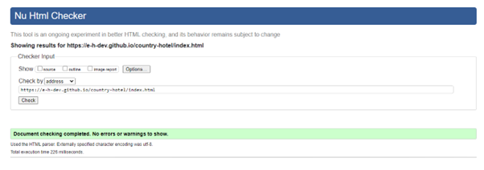

#### Hotel Page

PASSED

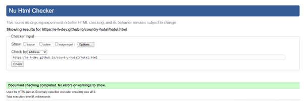

#### Restaurant Page

PASSED

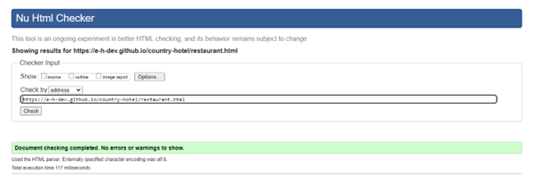

#### Book Page

PASSED

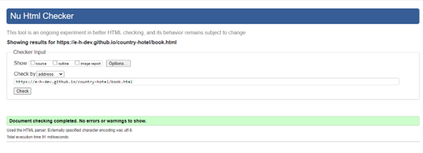

#### Booking Confirmation Page

PASSED

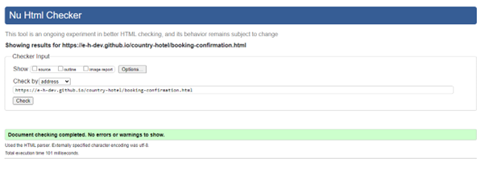

#### Style Sheet (css)

PASSED - no errors one warning (I used the @import at the top of style sheet for fonts.)

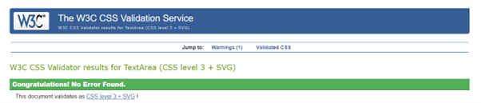

### Lighthouse.

I have tested all the website pages with lighthouse. Below are screenshots of the results.

#### Home Page

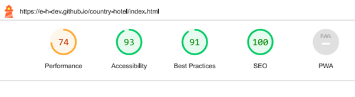

#### Hotel Page

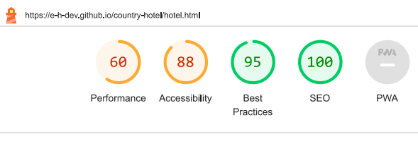

#### Restaurant Page

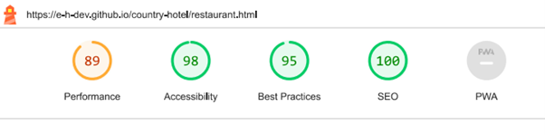

#### Book Page

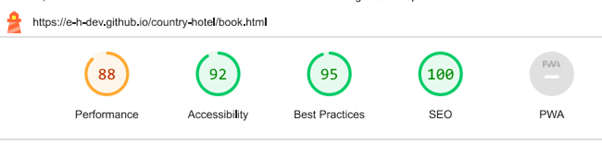

#### Booking confirmation page

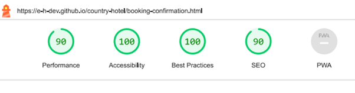

- - -

## MANUAL TESTING

### Testing User Stories

For each of the user goals, I have assigned with a reference from A - I. Each goal is supported below with a screenshot or gif of the website, proving the goal was accomplished.

#### Hotel Owners Goals.

| REF | Goals | How are they achieved? |
| :--- | :--- | :--- |
| A | We want the website to attract a new and wide range of customers. | With a modern and up to date website, users will simply be able to find us using a web search. |
| B | We want an attractive website which clearly shows our goals as hotel owners, providing an exclusive Experience to our guests. | The well-structured and tastefully designed website has clear information details. This will give the user a positive feeling when browsing the site. The users will come away with a clear understanding of the hotel and services. |
| C | We want the website to be easy and clear to use. | With clear and interactive navigation links the user will easily navigate the way around the website. |
| D | We want the website to be responsive to all devices. | Using technologies such as bootstrap and media queries, the website is responsive to a range of devices. |

#### Site Visitor Goals.

| REF | Goals | How are they achieved? |
| :--- | :--- | :--- |
| E | I want to have access to clear details regarding the Hotel if I was to book a stay. | The website has very clear and detailed information about the hotel. This will make Site visitors comfortable and confidant in their decision, to book a stay at the hotel. |
| F | I want to be able to contact the hotel in the simplest way. | The easy-to-use form on the booking page is a very simple way for the user to contact the hotel. Email address and Phone number are simple to retrieve form both the navbar and the footer. |
| G | I want to see what the company have to offer, on their restaurant menu. | The Restaurant page is simple to navigate to from all pages, it has a clear and well-illustrated menu. |
| H | I want the site to be responsive to my device. | Using technologies such as bootstrap and media queries, the website is responsive to a range of devices, ensuring the user has a convenient way of browsing the website. |
| I | I want the site to be easy to navigate. | Clear navigation links in the place where the user expects to navigate from, will make the navigation simple and straight forward for any user. |

#### Screen shots for Hotel Owner Goals.

#### (A)

#### (B)

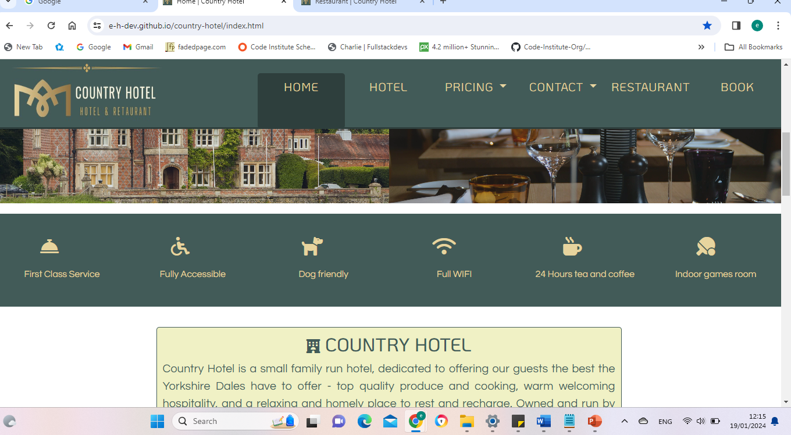

#### (C)

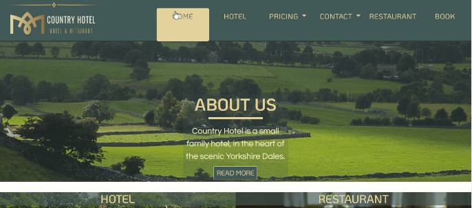

#### (D)

--

#### Screen shots for Site Visitor Goals.

#### (E)

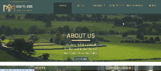

#### (F)

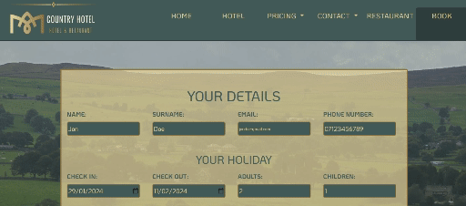

#### (G)

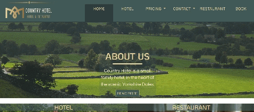

#### (H)

#### (I)

---

### Full Testing

Full testing was performed on a range of devices:

* A widescreen desktop
* Various Laptops.
* Android tablet.
* Mobile Devices.

The site was tested using the following browsers:

* Google Chrome
* Microsoft Edge
* Firefox
* AVG Secure Browser
* Opra

Additional testing was taken by friends and family on a variety of devices and screen sizes. They reported no issues when browsing.

`Home Page`

| Feature | Expected Outcome | Testing Performed | Result | Pass/Fail |
| --- | --- | --- | --- | --- |
| The Sites title | Link directs the user back to the home page | Clicked title | Home page reloads | Pass |
| Nav Bar | Hovering cursor over each link it changes to light colour. | Hovered over links | Colour of links changed | Pass |
| Home link | Link directs the user back to the home page | Clicked link | Home page reloads | Pass |
| Hotel link | Link directs the user to hotel page | Clicked link | Hotel page loads | Pass |
| Prices Dropdown | Basic hotel pricing should come down in a small box | Clicked dropdown | Prices appear | Pass |
| Contact Dropdown | Hotel Contact email and Phone number should come down in a small box | Clicked dropdown | email and phone number appear | Pass |
| Restaurant link | Link directs the user to restaurant page | Clicked link | Restaurant page loads | Pass |
| Book link | Link directs the user to Book page | Clicked link | Book page loads | Pass |
| Read More Button | Button should push the page down to the main information paragraph | Clicked Button | Main information paragraph appeared | Pass |
| Hotel image link | Should animate when hovered over | hover over | image zooms in | Pass |
| Hotel image link | Link directs the user to hotel page | Clicked link | Hotel page loads | Pass |
| Restaurant image link | Should animate when hovered over | hover over | image zooms in | Pass |
| Restaurant image link | Link directs the user to restaurant page | Clicked link | Restaurant page loads | Pass |
| Google map | Map should show location (Keld) and should be interactive | Map shows correct location, map zooms in and out can change map type view and can move the map | Pass |
| Footer logo | Should link back to top of page | Clicked on logo | Page scrolls back to the top | Pass |
| Social links | Should open new tab to the home page of Facebook, twitter, YouTube and Instagram | click on icon | New tab opens with home page of selected social media. |

---

`Hotel Page`

Nav bar links and footer links are the same as in home page and passed all testing for the hotel page.

| Feature | Expected Outcome | Testing Performed | Result | Pass/Fail |
| --- | --- | --- | --- | --- |
| Select a room button | Should scroll the page down to room selection images | Pressed button | Page scrolls to room selection images | Pass |
| Our grounds button | Should scroll down to grounds information section (below bedroom section) | Pressed button | page scrolls down to grounds information section | Pass |
| King bed image | Should animate when hovered over | hover over | image zooms in | Pass |
| Double bed image | Should animate when hovered over | hover over | image zooms in | Pass |
| Twin bed image | Should animate when hovered over | hover over | image zooms in | Pass |
| King bed image| Link directs the user king bed information section | Clicked link | Scrolls down to king bed information section | Pass |
| Double bed image| Link directs the user double bed information section | Clicked link | Scrolls down to double bed information section | Pass |
| Twin bed image| Link directs the user twin bed information section | Clicked link | Scrolls down to twin bed information section | Pass |

`Navbar dropdowns`

| Feature | Expected Outcome | Testing Performed | Result | Pass/Fail |
| --- | --- | --- | --- | --- |
| Pricing dropdown | A dropdown box with price information should appear | Click on the dropdown | Prices appear | Pass |
| Contact dropdown | A dropdown box with contact information should appear | Click on the dropdown | Contact information appears | Pass |

`Restaurant page`

Nav bar links and footer links are the same as in home page and passed all testing for the restaurant page.

| Feature | Expected Outcome | Testing Performed | Result | Pass/Fail |
| --- | --- | --- | --- | --- |
| Menu button | Page should scroll down to menu | Pressed button | Page scrolled down to menu | Pass |
| Beef menu image | Should animate when hovered over | Hover over | Image zooms in | Pass |
| Sea food menu image | Should animate when hovered over | hover over | image zooms in | Pass |
| Dairy menu image | Should animate when hovered over | hover over | image zooms in | Pass |
| Beef menu image| Link directs the user to beef menu section | Clicked link | Scrolls down to beef menu section | Pass |
| Sea food menu image| Link directs the user to Sea food menu section | Clicked link | Scrolls down to sea food menu section | Pass |
| Dairy menu image| Link directs the user to dairy menu section | Clicked link | Scrolls down to dairy menu section | Pass |

`Book page`

Nav bar links and footer links are the same as in home page and passed all testing for the book page.

| Feature | Expected Outcome | Testing Performed | Result | Pass/Fail |
| --- | --- | --- | --- | --- |
| Input boxes | Should change colour when selected | Clicked on box | Colour changed | Pass |
| Name input boxes | Should be able to fill in with name | Type name in | Name was saved in box | Pass |
| Date input boxes | should pull up calendar when icon is selected | select icon | Calendar appears | Pass |
| Guests number selection boxes | Should have active selection arrows | Click on arrows | Numbers increase and decrease when selected. | Pass |
| Guests number selection boxes | Should have a min and max selection | Click on arrows | Can not pass or select less than required number of guests | Pass |
| Restaurant selection dropdown | should show list of menus when clicked | Click on arrow | List of menu appears | Pass |
| Menu number selection boxes | Should have active selection arrows | Click on arrows | Numbers increase and decrease when selected. | Pass |
| Menu number selection boxes | Should have a min and max selection | Click on arrows | Can not pass or select less than required number of meals | Pass |
| Form Rest Button | Should reset form | Pressed button | Form resets | Pass |
| Book now button | Should bring up conformation of boking message | Pressed button | Booking confirmation message loads | Pass |

`Booking confirmation page`

| Feature | Expected Outcome | Testing Performed | Result | Pass/Fail |
| --- | --- | --- | --- | --- |
| Check out our Menu message | Should load restaurant page on new tab when the word "Menu" is selected | Selected the word Menu | Restaurant page opens in a new tab | Pass |
| Home logo link | Should animate when hovered over | Hovered over logo | Logo zooms in | Pass |
| Home logo link | Should take user back home | Pressed the logo | User was taken back home | Pass |

