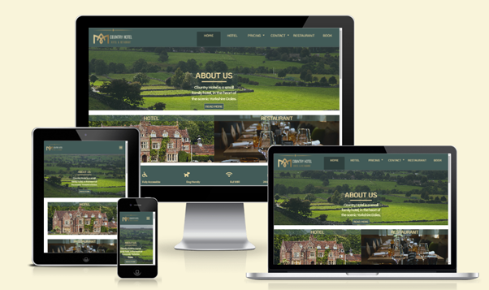

# Country Hotel -  Testing

Visit the deployed site: [Country Hotel](https://e-h-dev.github.io/country-hotel/)

- - -

## CONTENTS

* [AUTOMATED TESTING](#automated-testing)
  * [W3C Validator](#w3c-validator)
  * [Lighthouse](#lighthouse)
* [MANUAL TESTING](#manual-testing)
  * [Testing User Stories](#testing-user-stories)
  * [Full Testing](#full-testing)

Testing was ongoing throughout the entire build. I utilised Chrome developer tools whilst building to pinpoint and troubleshoot any issues as I went along.

During development I made use of google developer tools to ensure everything was working correctly and to assist with troubleshooting when things were not working as expected.

I have gone through each page using google chrome developer tools to ensure that each page is responsive on a variety of different screen sizes and devices.

- - -

## AUTOMATED TESTING

### W3C Validator

[W3C](https://validator.w3.org/) was used to validate the HTML on all pages of the website. It was also used to validate the CSS.

* [index.html](testing/w3/w3-index.png) - Passed.
* [game.html](testing/w3/w3-game.png) - No errors, 1 Warning. The warning is for an empty H2 tag. This is where the question is inserted using jQuery.
* [highscores.html](testing/w3/w3-highscores.png) - Passed.
* [404.html](testing/w3/w3-404.png) - Passed.
* [500.html](testing/w3/w3-500.png) - Passed.

* [style.css](testing/w3/w3-css.png) - Passed, no errors found.

- - -
